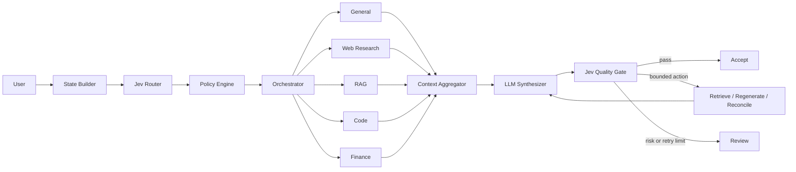

# NeuroRouter

> A Jev-powered probabilistic control plane for inspectable multi-agent AI systems.

[](https://github.com/aum2606/NeuroRouter/actions/workflows/ci.yml)
[](https://www.python.org/)
[](LICENSE)

NeuroRouter makes the control decisions behind an AI answer visible. Jev evaluates small,
independent propositions; deterministic Python policy turns their probabilities into an execution
plan; bounded specialists gather evidence; an LLM synthesizes only when useful; and a second Jev
stage evaluates the candidate before it is accepted, retried, or sent for review.

This is an AI operations interface, not a chatbot wrapper. Every route, threshold, dependency,
latency, source, retry, and model choice is persisted and inspectable.

## Why this architecture

Many agent systems ask one model to decide what to do, perform the work, and judge its own answer.
NeuroRouter separates those responsibilities:

- **Probabilistic judgment:** Jev returns complete Choice, Score, and Noul distributions.
- **Deterministic control:** versioned YAML thresholds produce an explainable execution plan.
- **Bounded execution:** specialist agents have explicit inputs, outputs, and failure boundaries.
- **Evidence-first synthesis:** sources are normalized, deduplicated, ranked, and budgeted.
- **Independent quality control:** six atomic quality propositions drive bounded retry policy.
- **Operational observability:** SQLite traces power live and historical Streamlit views.



See [Architecture](docs/architecture.md) for the component boundaries, request lifecycle, retry
state machine, and persistence model.

## What the dashboard exposes

| Surface | What it demonstrates |
| --- | --- |
| Command Center | live routing probabilities, activated agents, graph, timeline, response, quality |
| Trace Explorer | durable state, plans, distributions, timings, errors, raw debug payloads |
| Decision Lab | counterfactual routes from changed thresholds without another model call |
| Knowledge Base | PDF/TXT/Markdown ingestion, chunk metadata, and Chroma collection status |
| Evaluations | measured accuracy, F1, Brier score, calibration, confusion matrix, comparisons |

The repository deliberately ships no fabricated traces or benchmark claims. Evaluation charts
appear only after real predictions are recorded.

## Quick start

Python 3.11 or newer is required. No API key or billing account is needed for the local demo.

```bash
git clone https://github.com/aum2606/NeuroRouter.git
cd NeuroRouter
python -m venv .venv
# Windows: .venv\Scripts\activate
# macOS/Linux: source .venv/bin/activate
python -m pip install -e ".[dev,rag]"
# Windows: copy .env.example .env
# macOS/Linux: cp .env.example .env
streamlit run app.py
```

Open `http://localhost:8501`. Without `TYPESAFE_API_KEY`, routing and quality checks use the
configured conservative fallback. The deterministic `mock` synthesizer keeps the complete flow
runnable without an external LLM request.

Run the quality gate:

```bash
ruff format --check .
ruff check .
pytest --cov=neurorouter --cov-report=term-missing
```

## Free-tier LLM configuration

`mock` is the default and cannot incur API charges. Three optional hosted adapters are included;
only the provider explicitly selected in `.env` is called.

| Provider | Configured tiers | Environment variable |
| --- | --- | --- |
| Groq | `openai/gpt-oss-20b`, `openai/gpt-oss-120b` | `GROQ_API_KEY` |
| Gemini | `gemini-3.5-flash-lite`, `gemini-3.6-flash`, `gemini-3.8-flash` | `GEMINI_API_KEY` |
| OpenRouter | `openrouter/free` | `OPENROUTER_API_KEY` |

```dotenv
NEUROROUTER_LLM__PROVIDER=groq  # or gemini / openrouter
GROQ_API_KEY=your_key_here
```

`allow_paid_models` defaults to `false`, and OpenRouter model names are runtime-validated to be
`openrouter/free` or end in `:free`. NeuroRouter never silently switches providers. Hosted free
tiers are subject to provider quotas and account policies, so keep billing disabled in the provider
account when zero billing exposure is a requirement. Model IDs live in YAML because catalogs
change independently of application code.

## Key implementation details

- One batched routing request contains intent Choice, seven atomic Noul questions, and two Scores.
- The policy engine gates unavailable capabilities and records every threshold it triggered.
- Independent agents run concurrently with `asyncio`; dependency edges remain explicit.
- Wikipedia supplies a keyless development web-search implementation behind a provider interface.
- Local RAG preserves document, page, chunk ID, and relevance metadata in every result.
- Python execution is disabled by default and restricted when deliberately enabled.
- Finance refuses current-market claims when the required fresh web evidence is absent.
- Retry actions are deterministic and capped at two by default—there is no recursive agent loop.
- Secrets are loaded separately and never included in routing state or trace snapshots.

## Evaluation

The starter JSONL dataset is balanced across all seven intents and validates on load. It is
infrastructure for measured experiments, not a benchmark claim.

```bash
# Requires TYPESAFE_API_KEY for real Jev predictions
python evals/evaluate_router.py

# Compare two stored, measured runs
python evals/compare_baseline.py --baseline-run RUN_A --candidate-run RUN_B
```

Metrics include intent accuracy, per-capability precision/recall/F1, confusion matrix, Brier score,
calibration bins, latency, and unnecessary-tool activations.

## Configuration and data

- `config/settings.yaml` — capabilities, providers, persistence, budgets, and model tiers.
- `config/thresholds.yaml` — deterministic routing, planning, quality, and retry policy.
- `config/prompts.yaml` — versioned synthesis instructions and evidence format.
- `.env` — local secrets and overrides; ignored by Git.
- `data/neurorouter.db` — request traces; generated locally and ignored.
- `data/chroma/` — vector collection; generated locally and ignored.

Environment overrides use the `NEUROROUTER_` prefix and `__` for nesting, for example
`NEUROROUTER_TELEMETRY__DATABASE_PATH=data/demo.db`.

## Documentation

- [Architecture and design invariants](docs/architecture.md)
- [Demo runbook](docs/demo.md)
- [Deployment guide](docs/deployment.md)
- [Security policy and execution boundaries](SECURITY.md)

## Project status

The twelve-phase portfolio implementation is complete: schemas, Jev routing, deterministic policy,
specialists, RAG, parallel orchestration, synthesis, quality control, bounded retries, telemetry,
five Streamlit surfaces, evaluations, CI, and deployment assets are implemented and tested.

NeuroRouter is released under the [MIT License](LICENSE).
