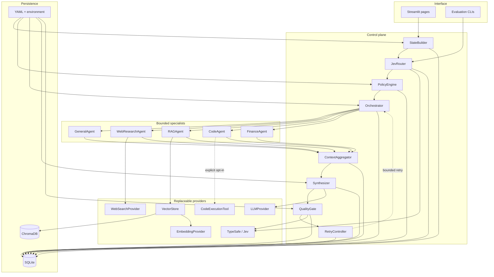
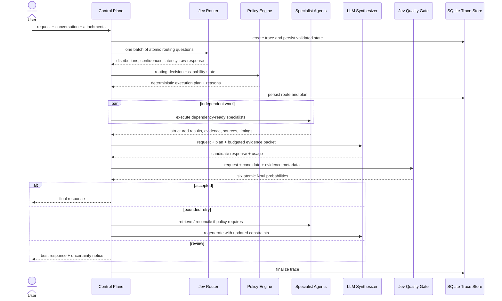
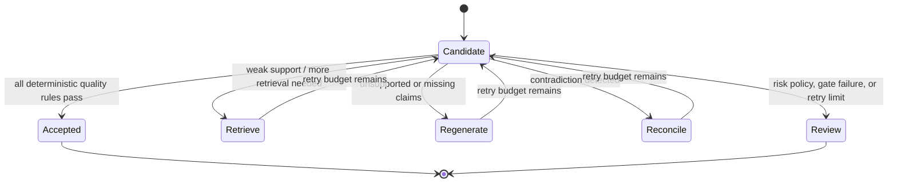

# NeuroRouter architecture

NeuroRouter is a synchronous control plane with bounded asynchronous execution. It deliberately
keeps probabilistic classification, deterministic authorization, specialist work, language
generation, and quality control in separate modules.

## Component boundaries



Provider interfaces isolate external APIs. A model, web, embedding, vector, or execution provider
can change without rewriting policy or agent contracts.

## Request lifecycle



## Routing contract

The initial Jev call does not ask for a workflow. It evaluates ten independent judgments that
share the same state:

- one intent `Choice` across seven semantically described options;
- seven `Noul` propositions for web, RAG, code, data analysis, current information, citations, and
  multi-source research;
- ordered complexity and risk `Score` questions.

The `RoutingDecision` stores normalized values and complete probability distributions. A Noul is
already the probability that its proposition is true; it is not converted into a Choice
confidence.

## Deterministic planning

`PolicyEngine` compares those probabilities with `config/thresholds.yaml`, intersects requested
tools with runtime capabilities, selects an LLM tier primarily from complexity, and emits plain
policy explanations. The Decision Lab can replay the same stored decision against other thresholds
without calling Jev or an LLM.

This separation makes model judgment and business policy independently testable:

```text
probability (Jev) + threshold/capability (Python) = execution decision
```

## Quality and retry state machine



The quality batch asks whether the response answers the request, is supported, contains unsupported
claims, omits important information, contradicts evidence, or needs more retrieval. Python policy
composes the result. `quality.max_retries` defaults to two.

## Persistence model

SQLite stores one request-level trace plus ordered stage events. Snapshots include validated state,
routing distributions, the execution plan, agent and tool results, token usage, synthesis, quality
attempts, retries, final status, and bounded errors. ChromaDB stores only indexed chunks and their
retrieval metadata. Credentials are loaded through a separate settings object and are never part of
the router state.

## Design invariants

1. Jev makes atomic judgments; it does not generate user-facing prose or choose a full workflow.
2. Only deterministic policy authorizes capabilities and retry actions.
3. Agents are bounded executors, not autonomous recursive planners.
4. External providers are selected explicitly; no silent paid-provider fallback exists.
5. Every loop is bounded and every stage can be traced.
6. Failure in one optional specialist does not erase successful independent results.
7. Dashboard metrics represent persisted executions, never seeded marketing data.
